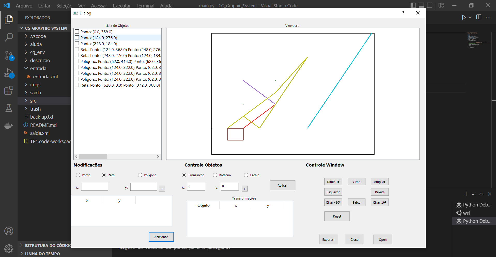

# TP1 - Display File e Transformada de Viewport 

<b>Alunos</b>:  André Vinícius e Filipi Maciel

<b>Disciplina</b>: Computação Gráfica

O objetivo desse trabalho é desenvolver um programa que seja capaz de ler um arquivo contendo informações a respeito dos objetos a serem desenhados, da <i>window</i> e da <i>viewport</i>, e gerar um arquivo de saída contendo os objetos no sistema de coordenadas de <i>viewport</i>.

## Pré-requisitos

Inicialmente, é necessário que haja a instalação do Python em sua máquina, a instalação pode ser feita pela própria Windows Store. Posteriormente, precisamos instalar o PySide5, biblioteca responsável pela interface gráfica do nosso programa.

``pip install pyside5``

### Estrutura do arquivo xml

Para o sistema gráfico executar corretamente o xml precisa ter <b>obrigatoriamente</b> a seguinte estrutura:

'''
<?xml version="1.0" ?>
<dados>
	<viewport>
		<vpmin x="00" y="00"/>
		<vpmax x="00" y="00"/>
	</viewport>
	
	<window>
		<wmin x="00" y="00"/>
		<wmax x="00" y="00"/>
	</window>

	<ponto x="00" y="00"/>

	<reta>
		<ponto x="00" y="00"/>
		<ponto x="00" y="00"/>
	</reta>

	<poligono>
		<ponto x="00" y="00"/>
		<ponto x="00" y="00"/>
		<ponto x="00" y="00"/>
		<!-- <ponto> adicionais -->
	</poligono>
</dados>
'''

## Como executar

Para executar o trabalho, é preciso abrir o arquivo ``main.py`` nas pasta a pasta ``src`` e executar pelo próprio Vs Code por exemplo. Basta ir em ``Executar`` depois ``Executar sem Depuração``, como mostrado na imagem.

No caso do linux:

``cd src``
``python3 main.py``

Feito isso será apresentada a tela do Sistema Gráfico:

Clique no botão ``Open`` para adicionar o arquivo xml que deseja. Adicionado o arquivo e esse arquivo sendo construído conforme a estrutura apresentada acima no texto, basta clica em quais objetos deseja visualizar na viewport, conforme apresentado na imagem abaixo.

